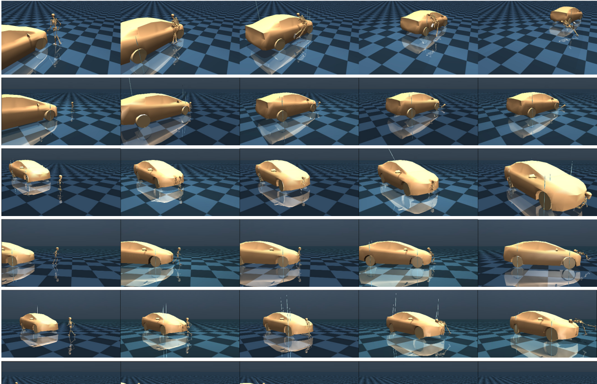

# PeDesCar

This intends to generate datasets related to impact collision using Mujoco Physics Engine, OpenAI, RL for human motion prediction.

Accepted Paper – WSCG 2025

Explore our latest research and reproducible results: [Paper PDF](http://wscg.zcu.cz/WSCG2025/papers/C47.pdf)

Sample Data is available in the `sample_data` folder.  

For the full dataset and collaboration opportunities, reach out via: [QualityMinds LinkedIn](https://www.linkedin.com/company/qualityminds-gmbh/)

## Installation

tested on python 3.8.10

Copy the mujoco license in the `bin` folder.

First be sure you have the linux package required to run the environment:

```bash
sudo apt-get install libglew-dev
pip install wheel setuptools pip --upgrade
```

Clone this repo:

```bash
git clone https://github.com/QualityMinds/PeDesCar.git
```

Install package:

```bash
pip3 install -r requirements.txt
pip3 install -e pedestrian-impact/ # to install the environments
```

Install imitation_lib:

```bash
git clone https://github.com/robfiras/ls-iq.git
cd ls-iq
python3 -m pip install -e .
cd ../
```

Install loco-mujoco and get dataset:

```bash
git clone --branch v0.1.0 https://github.com/robfiras/loco-mujoco.git
cd loco-mujoco
python3 -m pip install .
loco-mujoco-download
cd ../
```

Copy pretrained agents file:

```bash
cp -R /mnt/nfs-nasmonster/ai-research/notebooks/kiattention/impact_collision_dataset/agents pedestrian-impact/pedestrian_impact/envs/
```

## Run (main files)

Run code for dataset generation.

```bash
python dataset_generation.py "logs/" 5 1
```

Run code for dataset visualization

```bash
python dataset_visualizer.py "path-experiment-experiment" 0 --save-numpy
```

Run code for dataset analysis

```bash
python dataset_analysis.py "path-experiment-experiment" 0
```

Run code for figure plots (ongoing and not validated)
path should be changed in the code.

```bash
python figures_for_paper.py
```

## TODO

We made a plan composed of the following milestones:

- [X] Car modelling.
- [X] Replace OpenAI Human model by MyoHuman model.
- [X] Run Env with MyoHuman Human model.
- [ ] Train a Imitation algorithm on MyoHuman to learn motions.
- [ ] Run Env with MyoHuman Human model using the learned motions.
